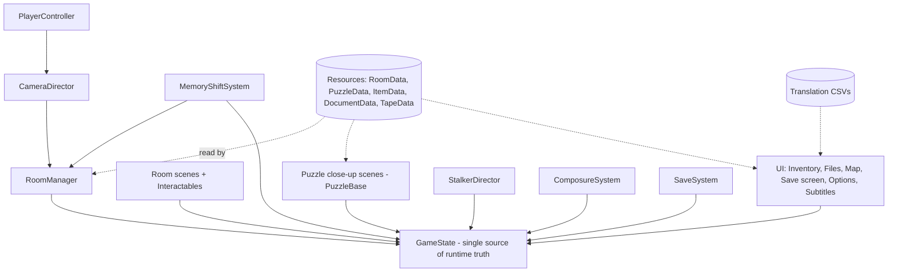

# Ward Zero / Aile Zéro: Implementation Plan Overview

**Status:** Handoff draft v1.0
**Source of truth for design:** [`GDD.md`](./GDD.md) (v1.0). This plan cites GDD sections as `§n.n`.
**Audience:** The developer (or agent) who builds the game. Read this first, then the doc for the phase you're working on.

---

## 1. Document Map

| Doc | Covers | Use it when |
|---|---|---|
| `00-overview.md` (this doc) | Engineering rules drawn from the pillars, architecture, roadmap for every milestone, cross-cutting checklists, open questions | You need context or are planning work across phases |
| [`01-foundation.md`](./01-foundation.md) | Repo setup, toolchain, project settings, code skeleton, data schemas, CI/CD, the art pipeline, and the **M0 tech spike** | Starting the project, up to the end of M0 |
| [`02-milestone-1.md`](./02-milestone-1.md) | **M1 vertical slice** (Act 1): tasks, content specs, acceptance criteria, test plan | After M0 exits |
| [`adr/`](./adr/) | Architecture decision records | Before changing a decision |
| `03-…` onward | M2–M5. Write each one at the end of the milestone before it, using the measurements from that milestone | Later |

> **Repo location:** `Darkamui/ward-zero` (task F-01). It began in the `ward-zero/` folder of `Z-Pong`, and its history was carried over with `git subtree split`.

---

## 2. The Game in Six Lines

- A fixed-camera, pre-rendered survival-horror escape room in the style of classic Resident Evil. It runs in desktop browsers and is played with mouse and keyboard.
- There are 33 rooms and 22 puzzles. Story is delivered through 12 truth fragments, and there are 3 endings decided by a finale timeline puzzle (P21).
- An unkillable stalker is simulated on the room graph. Hiding and running are the only defenses.
- Memory shifts swap a room to its 1976 version. Objects carry forward in time, never backward.
- Threat difficulty and puzzle difficulty are chosen separately. Codes are generated from a seed.
- It ships in English and Québec French from day one. Engine: Godot 4 web export (Compatibility renderer, single-threaded).

---

## 3. Design Pillars as Engineering Rules

The pillars in §1 are turned into rules here that can be checked in code review. A change that breaks one of these rules is a bug, even if it "works".

| # | Rule | Comes from | How it's enforced |
|---|---|---|---|
| R1 | **Never bake puzzle-critical text or numbers into a pre-rendered image.** Plaques, notices, dials and boards show their values through dynamic overlays or close-up UI. | Seeded codes (§7), bilingual (§11) | Art checklist item. PuzzleData lists every seeded field with the node that displays it. |
| R2 | **Puzzle-critical nodes can't be touched by composure or hallucination effects.** | Pillar 3, §5.4 hard rule | Puzzle-critical nodes go in the `puzzle_critical` group. ComposureSystem ignores that group. A unit test checks this. |
| R3 | **No user-facing string literals.** Everything goes through translation keys, and documents re-render from their keys when the language changes. | §11, §9.2 Localization | A lint script finds string literals in `.gd`/`.tscn` text properties. CI fails on keys missing from either language. |
| R4 | **Translations must keep their placeholders.** EN and FR versions of a string have identical `{placeholder}` sets. | Seeded templates (§9.2) | A localization lint step in CI. |
| R5 | **Never encode information in color alone.** | §7 authoring rules, §12 | Puzzle checklist. Every colored element also has a shape, symbol or text. |
| R6 | **Every audio cue that matters has a visual alternative.** | §7, §10, §12 | Puzzle checklist. An options toggle for sound-direction indicators. |
| R7 | **A failed attempt costs noise, never progress.** No puzzle can reach an unsolvable state. | §7 authoring rules | Each puzzle has a test that it can still be solved after any sequence of wrong inputs. |
| R8 | **A clue must be reachable before the puzzle that needs it, and it must be re-examinable or stored in Files.** | §7 authoring rules | Clue dependency table per milestone (see M1 §3). The playtest script walks the critical path. |
| R9 | **At least 3 seconds of telegraphing before any stalker entry.** | §5.1 | StalkerDirector enforces a minimum delay between announcing and spawning. Tested. |
| R10 | **Stay within the web budget.** First download ≤ 40 MB. Each act pack 15–25 MB. 60 fps on integrated GPUs. | §9.4 | CI size report. A perf check at every milestone exit. |
| R11 | **Saves stay portable.** JSON with a version number, a migration path, and export/import as text. | §9.2 SaveSystem | Round-trip tests. A migration test for every schema bump. |

---

## 4. Architecture at a Glance

The systems are the ones in §9.2. Their layering is shown below. Arrows point toward the dependency. Lower layers never call up into higher ones. They emit signals instead.

**Key decisions.** Each is recorded as an ADR in `docs/adr/` during Foundation.

| ADR | Decision | Why |
|---|---|---|
| 001 | Godot 4.x, the latest stable at project start (≥ 4.3), pinned for the whole project. Upgrade only between milestones. | §9.1 |
| 002 | **GDScript only**, statically typed | Godot 4 C# can't reliably export to web. Static types catch errors and run faster. |
| 003 | All content is data-driven through custom `Resource` classes. Rooms are scenes and hold no game logic beyond room-specific scripts. | §9.2 |
| 004 | **A memory variant is a state of the same room scene**, not a separate scene. It swaps the background set, toggles `present_only`/`memory_only` node groups, and switches the ambience. | The GDD says the geometry and cameras are identical (§9.3 step 7). This halves the number of scenes to maintain, and proxies and navmesh are shared automatically. |
| 005 | All seeded values come from `Seed.derive(puzzle_id, field)`, which is deterministic for a given playthrough seed | Seeded codes, NG+ (§7, §8.3) |
| 006 | The off-screen stalker is a room-graph simulation. He's spawned in 3D only when he's in, or entering, the player's room. | §5.1 |
| 007 | Game state changes only through GameState methods, which emit signals. Nothing else changes state directly. | Makes saving and debugging simple |

---

## 5. Roadmap

The milestones are the ones in §13.1. **Foundation** covers the repo and tooling setup plus the M0 tech spike, because the spike needs a real project skeleton to prove anything.

| Phase | Scope (summary) | Exit criteria | Plan doc |
|---|---|---|---|
| **Foundation + M0** | Repo, CI, project skeleton, autoload stubs, data schemas, the full background pipeline on 1 room with 2 cameras, occlusion, click-to-move across a camera cut, 1 hotspot, web build on a static host | 60 fps in Chrome and Firefox on an integrated GPU. Occlusion passes the checklist. Pipeline documented. Size and time measurements recorded. | `01-foundation.md` |
| **M1: Vertical slice** | Act 1: G01–G06, P01–P05, inventory, Files, tapes, save/load, EN/FR, scripted stalker chase, the Chapel memory shift | An outside player finishes Act 1 in either language without help. Time per room measured. | `02-milestone-1.md` |
| **M2: Systems complete** | Stalker AI, hiding and breath-hold, composure, the difficulty matrix, map coloring, all three puzzle difficulty sets for P01–P05, resource-pack loading | All systems tuned on a test level, and Act 1 playable on all 9 difficulty combinations | to write |
| **M3: Act 2** | East and West wings, B01, P06–P13, the Satchel, 4 more memory variants | Content complete and playtested | to write |
| **M4: Acts 3–4 + endings** | Upper floor, basement, P14–P22, 3 endings, NG+ | Can be finished on every difficulty combination | to write |
| **M5: Polish** | Audio pass, LUT and grain pass, accessibility, FR proofreading, performance | Release candidate | to write |

### 5.1 When Each System Is Built

● = built or extended in this phase, ○ = stub or interface only, blank = not touched

| System | F/M0 | M1 | M2 | M3 | M4 | M5 |
|---|---|---|---|---|---|---|
| GameState | ○ | ● | ● | | ● | |
| SaveSystem (+ export/import) | ○ | ● | ● (difficulty save rules, cassettes) | | | |
| RoomManager | ● | ● | ● (packs) | | | |
| CameraDirector + occlusion | ● | ● | | | | ● (look pass) |
| PlayerController (click-to-move, run) | ● | ● | ● (noise) | | | |
| Interactable + actions | ● (1 hotspot) | ● | | ● | | |
| PuzzleBase + seeding | | ● (Normal only) | ● (Easy/Hard) | ● | ● | |
| Inventory, key pouch, Effects Bin, examine, combine | | ● | | ● (Satchel) | | |
| Files (documents and tapes) + subtitles | | ● | | | ● (NG+ hint) | ● |
| Localization pipeline | ○ | ● | | ● | ● | ● (proofread) |
| MemoryShiftSystem | | ● (1 room) | | ● | ● | |
| StalkerDirector | | ○ (scripted chase only) | ● | ● (tuning) | ● (finale) | |
| Hiding / breath-hold | | | ● | | | |
| ComposureSystem | | | ● | | | ● |
| Map | | ○ (data only) | ● | | | |
| Difficulty matrix | | ○ (selectors, Normal/Patient) | ● | | | |
| Resource packs per act | ○ (optional spike) | | ● | | | |
| Accessibility options | | ○ (subtitles, language) | ● (rebinding) | | | ● |
| Post-processing look (LUT, grain, CA, vignette) | ● (first pass) | | | | | ● |

---

## 6. Cross-Cutting Definitions of Done

Every content unit from M1 onward goes through these checklists. Copy them into the issue or PR.

### 6.1 Room DoD
- [ ] RoomData resource complete: id, cameras, exits with the key required, access flag, hiding spots, map rectangle, ambience
- [ ] Every camera has a background in WebP, 200–400 KB, with the LUT stack applied. Memory set too, if the room has one.
- [ ] **Occlusion check** passed for every camera (procedure in Foundation §8.4)
- [ ] Navmesh covers every reachable floor area. No hotspot is unreachable.
- [ ] Camera trigger volumes don't ping-pong at the boundaries
- [ ] A spawn marker for every incoming exit
- [ ] No baked puzzle-critical text (R1)
- [ ] Ambience loop and one-shot sounds hooked up
- [ ] Hours logged in `production/time_log.csv` (blockout, render, paintover, integration)

### 6.2 Puzzle DoD
- [ ] PuzzleData has parameter sets for every difficulty required by the current milestone, plus seeded fields and the noise on failure
- [ ] `setup(seed, difficulty)` is deterministic. Serialize/deserialize round-trips partial progress.
- [ ] All clues listed in the clue dependency table, and each is reachable before the puzzle (R8)
- [ ] Satisfies R5 (no color alone), R6 (visual alternative), R7 (no unsolvable state)
- [ ] Unit tests: solves with the correct input, wrong inputs emit noise, still solvable after wrong inputs, same result for the same seed
- [ ] EN and FR strings present. Placeholder lint passes.
- [ ] Playtested by someone outside the project (Normal, and Hard from M2 on)

### 6.3 Document / Tape DoD
- [ ] DocumentData or TapeData with a title key, a body or subtitle key, a fragment id, and placeholder bindings
- [ ] Re-renders when the language is switched while it's open
- [ ] Tapes: EN and FR audio processed (hiss, wobble), subtitles timed for both languages

---

## 7. Technical Risks and Where They're Retired

| Risk | Retired in | How |
|---|---|---|
| Occlusion alignment through AI paintover | M0 | Test the full pipeline on one room. Write the occlusion check procedure. |
| Web performance and download size | M0, then re-checked at every exit | Measure compressed transfer size and fps on integrated GPUs. Fall back to a custom export template with unused modules stripped. |
| **Web audio sample-playback limits** (bus effects such as low-pass and reverb may not apply in Sample mode) | M0 | Test. If confirmed, bake the processing into the assets (memory-room muffling, tape effects) and only use Stream playback where an effect has to run live. |
| IndexedDB persistence and loss | M0 (persistence), M1 (export/import) | Reload test. Text export of saves. |
| Resource packs on web | M0 optional spike, M2 for real | Download to `user://`, then `ProjectSettings.load_resource_pack`. |
| Scope / time per room | M1 | The time log feeds the cut list decision (§13.2) at the M1 retro |
| Bilingual drift | M1 onward | CI lint for missing keys and placeholders |

---

## 8. Open Questions

From GDD §14, plus questions raised while planning. Each one has an owner phase. Defaults are in place so work isn't blocked.

| # | Question | Default until decided | Decide by |
|---|---|---|---|
| Q1 | Final title: *Ward Zero / Aile Zéro* or *Sainte-Odile* | Repo and code name `ward-zero` | M5 |
| Q2 | Character models: asset store or custom? How unique does the Man in White's silhouette need to be? | Asset store for Mathieu. Kitbash a unique silhouette for the Man in White (strongly recommended). | M1 start (needed for the chase) |
| Q3 | Number of Blank Cassettes on Committed | 12 | M4 playtest |
| Q4 | Exterior arrival scene before the Dayroom? | No | M4 |
| Q5 | **Where does Act 1's stalker reveal trigger?** (§5.2 gives the route but not the trigger) | After P04, the first time the player enters the Lobby (M1 §2) | M1 |
| Q6 | **Where does the wristband come from?** | Worn from the start, in the key pouch | M1 |
| Q7 | **Where is P04's cipher memo?** | Records Office, so the Admin safe depends on two rooms | M1 |
| Q8 | **Act 1 has no designed item combine.** Add one, or test combine in a debug room? | Debug room in M1. Design the first real combine in M3. | M1 |
| Q9 | Static host for a private project: GitHub Pages needs a public repo or a paid plan | itch.io restricted page (butler) for playtests. Optionally a password-protected Cloudflare Pages project. | Foundation |
| Q10 | Which TTS provider and voices for EN/FR tapes? (Licensing for any future release) | Choose in M1. Record voice IDs and terms in `production/voices.md`. | M1 |

---

## 9. ID and Naming Conventions (Quick Reference)

| Thing | Format | Example |
|---|---|---|
| Room | GDD id, lower case in paths | `G01`, `rooms/g01_dayroom/` |
| Puzzle | GDD id | `P04`, `puzzles/p04_admin_safe/` |
| Fragment | GDD id | `F02` |
| Item | `item_<snake>` | `item_choleric_key` |
| Document | `doc_<snake>` (fragments: `doc_f01_admission_file`) | `doc_quiet_hours` |
| Tape | `tape_<nn>_<snake>` | `tape_01_claire` |
| Flag | `<scope>.<snake>` | `g01.chain_released`, `act1.chase_done` |
| Translation key | `<domain>.<id>.<field>` | `item.choleric_key.name`, `doc.quiet_hours.body` |
| Seeded field | `<puzzle>.<field>` | `p01.frequency`, `p04.founding_year` |
