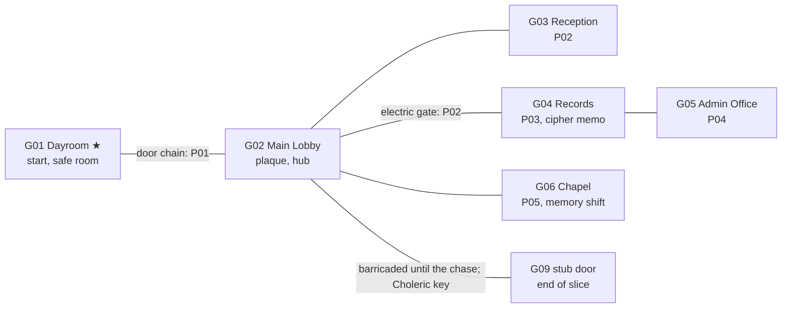

# Ward Zero: Milestone 1, Vertical Slice (Act 1)

**Goal:** Act 1 complete and shippable-quality: rooms G01–G06, puzzles P01–P05, inventory, Files, tapes, save/load, EN/FR, the scripted stalker chase, and one memory shift (Chapel).
**Exit (from §13.1):** someone outside the project plays Act 1 from start to finish in either language. A second, equally important output is **real hours per room**, which drives the scope decision for the rest of the game (§13.3).

**Prerequisites:** Foundation and M0 exited. The pipeline works, CI is green, and G01 exists as the M0 test room.
Sizing: **S** ≈ one session, **M** ≈ 2–4, **L** ≈ 5 or more. Rules R1–R11 and the DoD checklists come from [`00-overview.md`](./00-overview.md).

---

## 1. Scope

| In scope | Out of scope (milestone it moves to) |
|---|---|
| Rooms G01–G06, present day. Chapel (G06) 1976 variant. | G01 memory variant (M3). G07–G09 (M3, except a stub door in the Lobby). |
| P01–P05, **Normal parameters only**. PuzzleData has Easy/Hard slots that fall back to Normal. | Easy/Hard parameter sets (M2) |
| Seeded codes and document templates | NG+ reseed (M4) |
| Inventory (6 slots), key pouch, Effects Bin, 3D examine, combine (tested in the debug room) | Satchel / 8 slots (M3) |
| Files: documents, tapes, fragments. Dictaphone playback with subtitles. | Map UI (M2). RoomData holds `map_rect` now. |
| Manual save at the G01 tape recorder, autosave at act start, export/import as text | Observer autosave per room, Committed cassettes (M2) |
| Threat rules: **Patient** only. The New Game screen shows both selectors, with the other options disabled. | Observer/Committed behavior (M2) |
| Scripted Act 1 chase (Lobby → Dayroom) with full telegraphing | Room-graph AI, hiding, breath-hold (M2) |
| Noise events emitted and logged | Noise affecting the stalker (M2) |
| Options: language, subtitle size and box, volume sliders, skip door animation, fullscreen | Rebinding, photosensitivity and intensity sliders (M2/M5) |
| | Composure (M2). Puzzles only emit the hooks. |

---

## 2. Act 1 Flow

### 2.1 Room Graph (proposed. Final layout gets locked during greybox, task M1-20)

- G05 opens off G04, because the GDD has no Admin corridor room. Both sit behind the P02 gate.
- The Chapel is open from the start. Before the player has the Photograph, its resonant spot flickers and hums and shows a line foreshadowing what's coming (`g06.resonant_no_anchor`).
- **G09 stub door:** barricaded from the other side until the chase. The Man in White breaks through it. After that it's locked with the Choleric key, and using the key shows the **end-of-slice screen**. M3 replaces the stub with the real G09.

### 2.2 Critical Path and Beats (target about 45 min)

| # | Beat | Room | Gate | Approx. min |
|---|---|---|---|---|
| 1 | Wake up. Tape 01 plays on its own: *"Mathieu… viens me chercher."* Title card. Control handed over. | G01 | | 2 |
| 2 | Read the Quiet Hours notice. Tune the radio. The chain releases. | G01 | **P01** | 4 |
| 3 | Explore the Lobby. Examine the founding plaque (saved to Files). Barricaded corridor door. | G02 | | 4 |
| 4 | Directory and desk memo. Patch the switchboard. The gate buzzes open. | G03 | **P02** | 7 |
| 5 | Find the cipher memo. Use the wristband birthdate on the card catalog. Get F01 and the Photograph. | G04 | **P03** | 8 |
| 6 | Wall safe: plaque year + cipher → Choleric key and F02 | G05 | **P04** | 6 |
| 7 | **Reveal chase.** On first entering the Lobby with the Choleric key, the barricade gives way and he walks out. The player runs to the Dayroom. | G02 → G01 | scripted | 2 |
| 8 | Safe room: calm theme, save | G01 | | 1 |
| 9 | **Memory tutorial.** Photograph at the altar → 1976. Read the complete hymn board. Return and set the present-day board. The choir loft opens and gives the music box crank. | G06 | **P05** | 8 |
| 10 | Choleric key on the corridor door → end-of-slice screen | G02 | | 1 |

Steps 9 and 5–7 can run in either order once the player has the Photograph. Both orders need to be playtested. The end-of-slice screen does **not** require P05. It lists the puzzles solved and the fragments found. P05 matters later because its crank gates P11 in Act 2.

### 2.3 Clue Dependency Table (R8)

| Puzzle | Needs | Clue source → where it's kept | Reachable before? |
|---|---|---|---|
| P01 | `p01.frequency` | Quiet Hours notice, G01 → Files `doc_quiet_hours` | Yes, same room |
| P02 | `p02.extensions`, route | Staff directory and desk memo, G03 → Files | Yes, same room |
| P03 | `p03.birth_day/month` | Wristband (key pouch), examine the inner side → Files auto note | Yes, from the start |
| P04 | `p04.founding_year`, `p04.shift` | Plaque, G02 → Files. Cipher memo, G04 → Files. | Yes, both before G05 |
| P05 | `p05.hymns[3]` | 1976 hymn board, G06 memory → Files auto note `doc_hymn_board_1976` | Yes, needs the Photograph (P03) |
| *(P18, Act 3)* | `p18.fire_time` | F02 clipping, G05 → Files | Planted now. **F02's template has to include this placeholder in M1.** |

---

## 3. Room Specs

Every room meets the Room DoD (Overview §6.1). Hotspot types: E = examine, T = take, U = use/interact, X = exit, L = locked.

| Room | Cams | Exits | Hotspots | Pickups / Docs | Audio | Access | Notes |
|---|---|---|---|---|---|---|---|
| **G01 Dayroom ★** | 2 | G02 (chained → P01) | Radio (U → P01), Quiet Hours notice (E → doc), tape recorder (U → save), Effects Bin (U), chained door (L), 2–3 flavor E | `doc_quiet_hours`. Dictaphone and wristband are in the key pouch from the start. | Ambience: hum, rain on windows. **Safe-room theme after the chase.** | never | Built in M0. Extend it here. |
| **G02 Main Lobby** | 3 | G01, G03, G04 (gate → P02), G06, G09 stub (barricade → Choleric key) | Founding plaque (E → close-up overlay + doc), gate (L), barricaded door, flavor E | `doc_founding_plaque` | Large reverb room tone, distant drips. Chase cues. | open (scripted in Act 1) | 3 cams = chase arena. Put the G09 door and the G01 door on **different sides of the room** from the gate, so the player's path never crosses his. |
| **G03 Reception** | 1 | G02 | Switchboard (U → P02), directory (E), desk memo (E), phone, flavor | `doc_staff_directory`, `doc_desk_memo` | Electrical buzz | scripted | |
| **G04 Records** | 2 | G02, G05 | Card catalog (U → P03), filing cabinets, cipher memo (E), flavor | `doc_cipher_memo`, `doc_f01_admission_file` (F01), Photograph (anchor) | Paper rustle, ticking pipes | scripted | |
| **G05 Admin Office** | 2 | G04 | Wall safe (U → P04), desk, flavor E | `doc_f02_fire_clipping` (F02), Choleric key | Clock tick, wind | scripted | |
| **G06 Chapel** | 2 (+2 memory) | G02 | Hymn board (U → P05), altar resonant spot (U with Photograph), choir loft stairs (L until P05), flavor | `doc_hymn_board_1976` (auto note in memory), music box crank | Present: cold, hollow. Memory: warm, muffled organ, faint children. | scripted | The only memory variant in M1 |

**Background count for M1:** 12 present + 2 memory = 14. **Close-ups:** radio, switchboard, card catalog drawer, cabinet, safe, plaque, hymn board = 7. **3D examine models:** dictaphone, wristband, Photograph, Choleric key, crank = 5. **Characters:** Mathieu, the Man in White.

---

## 4. Puzzle Specs (Normal)

Every puzzle extends `PuzzleBase` and meets the Puzzle DoD (Overview §6.2). Mechanics below are the **proposed** design. Paper-prototype P02 and P03 before building them (task M1-31).

| | P01 Radio | P02 Switchboard | P03 Card Catalog | P04 Wall Safe | P05 Hymn Board |
|---|---|---|---|---|---|
| **Close-up** | Radio face, tuning knob (drag), analog dial | Jack grid labeled with extension numbers, plug cables, ring key | Drawer fronts with range labels, opened-drawer view, cabinet | Four number wheels and a handle | Board with 3 rows × 3 digit slots, a tray of number cards |
| **Seeded fields** | `p01.frequency` (AM 550–1600 kHz, steps of 10) | `p02.extensions` (role → 3-digit extension, unique) | `p03.birth_day`, `p03.birth_month` (year fixed at 1967), `p03.cabinet` (1–12) | `p04.founding_year` (1890–1925), `p04.shift` (1–9) | `p05.hymns` (3 unique numbers, 100–699) |
| **Rule** | Set the dial to the frequency on the notice | The memo gives a route by role ("Night Desk, then the Administrator's line"). The directory maps role → extension. Patch 3 cables in the route order, then press ring. | Catalog indexed by birthdate. **Two drawer labels are swapped.** The cards inside the labeled drawer are visibly from another month, which leads to the swapped drawer. The card gives the cabinet number. | Code = each digit of the year + shift, mod 10 | Enter the three numbers seen on the 1976 board |
| **Feedback (R6)** | Static fades into the message near the target. **Visual alternative:** a signal-strength needle. | The ring key buzzes when the route is wrong. A lamp lights by each correctly patched jack (lamp plus a ✓ symbol). | Card contents are readable text | No per-wheel feedback. Pulling the handle opens it or clunks. | Board rattles if wrong |
| **Fail noise** | 0 (tutorial, safe room) | 1 hop per wrong ring | 1 hop per wrong cabinet rattle | 1 hop per wrong pull | 1 hop per wrong full set |
| **Saved state** | Dial position | Cable patches | Drawers opened, cabinet opened | Wheel positions | Cards placed |
| **Solve** | Message VO (subtitled) → `g01.chain_released`, chain drops | `g02.gate_open`, sound of the gate buzzing from the Lobby side | GiveItem F01 + Photograph, `p03.solved` | GiveItem Choleric key + F02 | `g06.loft_open`, the crank is reachable up in the loft |
| **Dead-state guard (R7)** | Freely adjustable | Cables can always be unplugged | Drawers can be reopened | Wheels are free | Cards can be returned to the tray |
| **Easy/Hard (M2 notes)** | Easy: frequency circled on the dial. Hard: riddle. | Easy 2 cables, Hard 4 | Easy: labels not swapped. Hard: also cross-reference the patient number. | Easy: 2 digits shown. Hard: shift + reverse. | Easy: 2 numbers. Hard: board shows hymn *titles*, and the hymnal maps them to numbers. |

**Colour rule (R5):** switchboard cables are colored but identified by the numbered tag on each plug. The safe and hymn board don't use color.

---

## 5. Items, Documents, Tapes

| Id | Kind / storage | Source | Notes |
|---|---|---|---|
| `item_dictaphone` | tool / pouch | Start | Plays tapes. Opens the tape list in Files. |
| `item_wristband` | tool / pouch | Start | **Examine reveal:** rotate to the inner side to read the birthdate → auto note in Files |
| `item_photograph` | anchor / pouch | P03 | Memory Anchor 1 |
| `item_choleric_key` | key / pouch | P04 | Yellow, fire symbol + "CHOLERIC" stamp (R5). Auto-used on its door. |
| `item_music_box_crank` | tool / slot | P05 | First main-slot item. Used in Act 2 (P11). |
| `doc_quiet_hours` | notice | G01 | `{frequency}` |
| `doc_staff_directory` | print | G03 | `{ext_*}` |
| `doc_desk_memo` | handwritten | G03 | Route by role |
| `doc_founding_plaque` | print | G02 | `{founding_year}`. Also a close-up overlay (R1). |
| `doc_cipher_memo` | typewriter | G04 | `{shift}` stated as a rule |
| `doc_f01_admission_file` | typewriter, **F01** | G04 | Birthdate placeholders **must match the wristband** |
| `doc_f02_fire_clipping` | print, **F02** | G05 | `{fire_time}` = `p18.fire_time` (seeded now for Act 3) |
| `doc_hymn_board_1976` | auto note | G06 memory | `{hymn_1..3}` |
| 2–4 atmosphere docs | any | Writer's choice | At least one in G02 and one in G06 |
| `tape_01_claire` | tape | Start (auto plays) | Claire, EN/FR, processed. Subtitled. |
| P01 radio message | VO line (not a tape) | P01 | Subtitled through the same system |

---

## 6. Systems Work

The acceptance criterion for each task is in its row. Tests named here go in `tests/`.

### 6.1 Core
| ID | Task | Size | Acceptance |
|---|---|---|---|
| M1-01 | **GameState** in full: flags, inventory (6 slots), key pouch, bin, fragments, documents read, tapes heard, room states (items taken, doors opened), difficulty, timeline. Every change goes through methods that emit signals (ADR-007). | M | Unit tests for every mutator and signal. `to_dict/from_dict` round-trips. |
| M1-02 | **SaveSystem:** 10 slots of JSON in `user://saves/`, version 1, migration hook, act-start autosave slot. **Export/import:** compressed JSON → base64 with a CRC. A corrupt or old import shows a localized error and never crashes. | M | Round-trip test with a full Act 1 state. Corrupt-string test. Survives a browser reload (manual). Export from Chrome, import in Firefox (manual). |
| M1-03 | **RoomManager:** transitions (fade to black + door SFX. Door animation can be skipped in options), spawn markers, restores room state when re-entering, `set_timeline()` | M | Taken items stay taken. Re-entering spawns at the correct door. Transitions under 1 s when the door animation is skipped. |
| M1-04 | **Interactable + actions/conditions:** cursor icons (eye, hand, arrow, lock), walk-to-then-interact, right-click cancels. **Use-item mode:** select in inventory → Use → cursor carries the item icon → click the hotspot. **Keys auto-use** on their own locked exits. Locked exits show `locked_message_key`. | M | Every action and condition has a unit test. Walk-to-interact works across a camera cut. |
| M1-05 | **PuzzleBase:** close-up host (opens over the room, right-click backs out), `setup(seed, difficulty)`, serialize/deserialize, signals *solved*, *failed_attempt*, *noise_emitted*. Pauses the world only when the difficulty rule says so. Puzzle-critical nodes are tagged (R2). | M | A template puzzle in the debug room passes the full Puzzle DoD test set. |
| M1-06 | **DocumentRenderer:** resolves `{placeholders}` from Seed and GameState, re-renders on language change, uses the style variants (typewriter, handwritten, print, notice) | S | Test: every Act 1 document renders in both locales with no unresolved `{…}` |
| M1-07 | **Noise plumbing:** puzzles, item drops and running emit `EventBus.noise_emitted`. StalkerDirector logs to the debug overlay. | S | Each source shows up in the log with the right hop count |
| M1-08 | **Debug tools:** overlay (F9: room, cam, timeline, seed, flags, noise log, occluder outlines), warp-to-room, flag editor, give item, set seed. **Debug room** with props for inventory overflow, combine, drop and persistent memory objects. Removed from release builds by a feature tag. | M | Not reachable in an export with the `release` tag |
| M1-09 | **Content validator** (`tools/validate_content.gd`, headless, runs in CI): every exit targets a real room and spawn; every referenced item, document and tape exists; every hotspot has a navmesh path from every spawn; every translation key exists | M | CI fails when something breaks deliberately (a test fixture proves it) |

### 6.2 UI
| ID | Task | Size | Acceptance |
|---|---|---|---|
| M1-10 | **Inventory** (satchel look): 6 slots, key pouch tab, item detail, Use, **Combine** (drag onto another item), Drop (droppable items only; it leaves a pickup and emits 1 hop of noise) | L | Combine and overflow work in the debug room. Keys and anchors can't be dropped. Fully usable by mouse. |
| M1-11 | **3D examine:** drag to rotate, scroll to zoom, reveal triggers when the view angle is within the threshold | M | The wristband's inner side reveals the birthdate and adds the Files note once |
| M1-12 | **Effects Bin** UI: two-pane transfer between inventory and bin | S | Contents persist through save/load |
| M1-13 | **Files** (manila folder): tabs for Documents, Tapes and Fragments. The reader uses the typewriter font. Re-renders live on language switch. Unread markers. | M | Switching the language while a document is open re-renders it |
| M1-14 | **Dictaphone player + subtitles:** timed lines, size options (S/M/L), optional background box, on by default. Shared by tapes and VO lines. | M | Subtitles stay in sync in both locales. Switching language mid-tape switches the audio and subtitles at the same timestamp (or restarts the line; record which). |
| M1-15 | **Save screen** (dictaphone look), load menu, export/import dialog (copy to clipboard, paste field), storage warning text in Options | M | Matches M1-02 acceptance from the UI |
| M1-16 | **Menus:** title, New Game (threat/puzzle selectors. Only Patient/Normal enabled, others labeled "coming soon"), pause, Options (§1 list), game over (Retry / Load), **end-of-slice screen** (puzzles solved, fragments found, play time, thanks + feedback link) | M | Every string localized. Fully usable without a keyboard except Esc. |

### 6.3 Gameplay
| ID | Task | Size | Acceptance |
|---|---|---|---|
| M1-17 | **MemoryShiftSystem:** `ResonantSpot` component (subtle flicker shader + low hum cue, both with intensity hooks for the photosensitivity option later), anchor use → transition FX (about 1.5 s whiteout to a warm grade) → `RoomManager.set_timeline(MEMORY)`: swaps background sets, toggles `present_only`/`memory_only` groups, swaps ambience. Leave by using the anchor again **or** through any door (always returns to the present). Room marked `stalker_blocked`. **Persistent-object API** (`mark_persistent(id)` → appears in the present) built and unit-tested in the debug room, unused in Act 1. Emits *shift_completed* (hooks for composure restore in M2). | M | The Chapel round trip works by both exits. Saving in memory isn't possible (no recorder), and loading always resumes in the present. |
| M1-18 | **Scripted chase** (StalkerDirector scripted mode): (1) Trigger: entering G02 with `item_choleric_key` and without `act1.chase_done`. (2) Telegraph **for at least 3 s** (R9): barricade creaks, footsteps panned to the G09 door side, heartbeat layer, screen edges desaturate. (3) He breaks through and walks the navmesh toward the player. **Speed: about 1.1× the player's walk, about 0.75× the player's run**, so the chase teaches that running saves you. (4) Reaching G01 → door slam, safe-room theme, `act1.chase_done`. (5) Caught → Patient game over. **A retry checkpoint at chase start** (see §9 D1). The telegraph is built as a reusable `ThreatCue` node for M2. | L | 5 of 5 internal runs: a player who double-clicks to run makes it. A player who only walks gets caught. The cues start at least 3 s before he can be seen. The chase works across all 3 Lobby cameras. |
| M1-19 | **Characters:** Mathieu (retargeted idle/walk/run/interact/turn, 15–25k triangles), the Man in White (unique silhouette, walk, reach/grab for the catch), both lit by each camera's light rig | L | Run through the occlusion check in every room. Feet don't slide at either speed. |

---

## 7. Content Production

**Greybox first.** Build all 6 rooms with clay renders (Blender Workbench or a flat material) and placeholder close-ups. Make the whole of Act 1 playable that way before any final art. This validates layout, puzzles and pacing cheaply. Final art then replaces the backgrounds without changing proxies, unless the layout itself changes.

| ID | Task | Size | Depends on |
|---|---|---|---|
| M1-20 | Greybox G01–G06: layouts, proxies, cams, clay renders, hotspots, camera triggers. **Lock the room graph.** | L | M1-03, M1-04 |
| M1-21 | Greybox playthrough of Act 1 with placeholder puzzle UIs, by yourself plus one friend | S | M1-20, M1-30…34 (logic) |
| M1-22…27 | Final art per room G01–G06 (kitbash, light, render, paintover, WebP, occlusion check). **Log hours per step for each one.** | L each | M1-21 |
| M1-28 | Chapel 1976 variant: re-texture and re-light, 2 renders, prop states | M | M1-27 |
| M1-29 | Close-up renders (7) and 3D examine models (5) | L | M1-21 |
| M1-30…34 | Puzzles P01–P05: logic and tests first, then close-up UI and art | M each | M1-05, M1-06 |
| M1-35 | Paper-prototype P02 and P03 with a friend before building them | S | |
| M1-36 | Writing EN: every Act 1 document, the plaque, notices, item names and descriptions, UI strings, tape and VO scripts, locked messages, flavor examine lines | M | Room graph locked |
| M1-37 | Translation to fr_CA plus a **native Québec French review** | M | M1-36 |
| M1-38 | Voices: choose a TTS provider (Overview Q10). Generate EN/FR for tape 01 and the radio VO. Processing chain (hiss, wobble, band-limit) saved as a preset. Subtitle timing. | M | M1-36, M1-37 |
| M1-39 | Fonts: typewriter face for documents and sans-serif for UI. Check full French coverage, including `œ Œ « »` and NBSP. Check licences. | S | |
| M1-40 | Audio: ambience loop + 3–5 one-shots per room, Chapel memory ambience (bake the muffling if M0 found bus effects don't work on web), SFX list (doors, chain, gate buzz, safe, switchboard, drawers, radio static, UI), safe-room theme, chase stinger, memory-shift cue | L | |

---

## 8. Suggested Sequence

| Phase | Work | Ends with |
|---|---|---|
| **A. Spine** | M1-01…09 on top of the M0 room. M1-35 paper prototypes. M1-39 fonts. | Debug room exercises every core system. Validator in CI. |
| **B. Greybox Act 1** | M1-20, M1-30…34 (logic + placeholder UI), M1-10…16 UI in parallel, first draft of M1-36 writing | **M1-21: Act 1 playable start to finish in greybox** (EN only is fine) |
| **C. Threat + memory** | M1-17, M1-18, M1-19 | Chase and Chapel shift feel right in greybox |
| **D. Art + audio** | M1-22…29, M1-40. One room at a time, with the time log updated after each. | All 14 backgrounds and 7 close-ups in. Occlusion checks pass. |
| **E. Localization + polish** | M1-37, M1-38, bug fixing, perf pass | Internal full run in FR with no missing strings |
| **F. Playtest + retro** | M1-50…54 (§10) | Exit criteria met. Retro written. |

**Check after room 2 of phase D:** if the average hours per room projected over 33 rooms is beyond what you're willing to spend, bring the cut-list discussion (§13.2) forward instead of waiting for the retro.

---

## 9. Decisions Made Here (change them if you disagree)

| # | Decision | Rationale |
|---|---|---|
| D1 | **The Act 1 scripted chase has a retry checkpoint** on Patient, so getting caught restarts the chase rather than reloading the last manual save | The first chase is a reveal and a tutorial. Losing 30 minutes to it contradicts "dread, not death". The GDD's lethal rules still apply fully from Act 2. |
| D2 | Chase triggers after P04 (Overview Q5) | Climax of the act. The Chapel memory shift after it works as the breather (§4.2). |
| D3 | Wristband in the key pouch from the start, birthdate on the inner side (Q6) | Uses the examine-reveal feature early, as a tutorial |
| D4 | Cipher memo in G04 (Q7) | P04 depends on three rooms (pillar 1) |
| D5 | The end-of-slice screen doesn't require P05 | Matches the real game, where the crank is a forward dependency. Playtest script still requires P05. |
| D6 | G05 opens off G04 | No corridor room exists in the GDD room list |
| D7 | Founding year and hymn numbers are seeded, so the plaque and board are overlays (R1) | Keeps the code space large. Also makes them localizable. |

---

## 10. Test Plan

### 10.1 Automated (CI)
- **Unit:** GameState, SaveSystem (round trip, corrupt import, migration stub), Seed, DocumentRenderer (all docs × 2 locales), every action and condition, MemoryShiftSystem (timeline swap, persistent API, exit-by-door), and for **each puzzle**: solves with the correct input, wrong input emits the specified noise, still solvable after 50 random wrong inputs (R7), deterministic for a given seed, serialize round trip.
- **Content validator** (M1-09).
- **Critical-path smoke test:** headless script that, for 20 random seeds, walks the room graph and calls each puzzle's solve API in critical-path order, then asserts that the end-of-slice condition is reached and every clue value shown in a document equals the puzzle's expected input. This catches seed and template mismatches, such as the wristband not matching F01.
- Size report: engine + Act 1 ≤ 40 MB compressed (Act 1 is part of the first download, §9.4).

### 10.2 Manual
| ID | Check |
|---|---|
| M1-50 | **Playtest script** (`production/playtest_act1.md`): both orders of the critical path, every locked door, every Files entry, save → reload at every point, export → import across browsers, language switch inside every UI (document open, tape playing, puzzle open, inventory open), caught during the chase → retry |
| M1-51 | External playtest **EN**: no hints. Record time per room, any spot stuck for more than 5 min, hints requested, bugs, quotes. |
| M1-52 | External playtest **FR** with a native Québec French speaker, same protocol, plus wording notes |
| M1-53 | Perf and browser matrix: Chrome, Firefox, Edge on an integrated GPU, every room, chase, memory transition. p95 frame time ≤ 16.7 ms. |
| M1-54 | **Retro** (`production/m1_retro.md`): hours per room broken down by step, a projection for 33 rooms and 22 puzzles, a cut-list recommendation, puzzle fairness findings, bugs moved to M2 |

**Fairness rule:** if a tester needs a hint on a puzzle, that puzzle fails. Fix the clue, then retest with a new tester.

---

## 11. Exit Criteria

- [ ] An outside player finishes Act 1 **in EN** and another **in FR**, with no help and all 5 puzzles solved
- [ ] First-run play time between 35 and 60 minutes (target 45)
- [ ] All Room, Puzzle and Document/Tape DoD checklists ticked for G01–G06, P01–P05 and every Act 1 document
- [ ] CI green: lint, unit, validator, critical-path smoke over 20 seeds, size budget
- [ ] 60 fps (p95 ≤ 16.7 ms) in every Act 1 room, the chase and the memory transition, on an integrated GPU in Chrome and Firefox
- [ ] Save/load restores exact state. Export/import works across browsers. Nothing is lost on a hard reload.
- [ ] Language can be switched at any moment with no stale or missing strings
- [ ] The chase meets M1-18 acceptance and was never described by testers as "cheap"
- [ ] Retro written, with a cut-list decision recorded and the M2 plan doc (`03-milestone-2.md`) drafted from it
- [ ] Tag `m1` pushed. Milestone build on the `web-milestone` channel.

---

## 12. M1 Risks

| Risk | Signal | Response |
|---|---|---|
| Art throughput is too slow | Room 2 of phase D takes much longer than the M0 test room | Simplify kitbash detail, reuse prop sets, cut paintover passes. Bring the cut-list decision forward (§8). |
| P03 deduction is unclear | A paper-prototype tester can't find the swapped drawer | Make the swapped cards more obviously out of range (a month name on every card), or fall back to the Easy variant as Normal |
| The chase feels cheap or confusing | Testers get caught without knowing why | More telegraphing, slower walk speed, a clearer path to the Dayroom (lighting the door), a hint line on retry |
| Gaps in FR quality or glyph coverage | Reviewer notes, missing-glyph boxes | Native review is part of the exit. Font check task M1-39. |
| TTS licence terms or voice quality | Provider terms forbid it, or voices sound robotic through processing | Record the terms in `production/voices.md`. Heavier processing. Keep the scripts short. |
| Web audio effects don't work | M0 report | Bake all processing offline (already the fallback in M1-40) |
