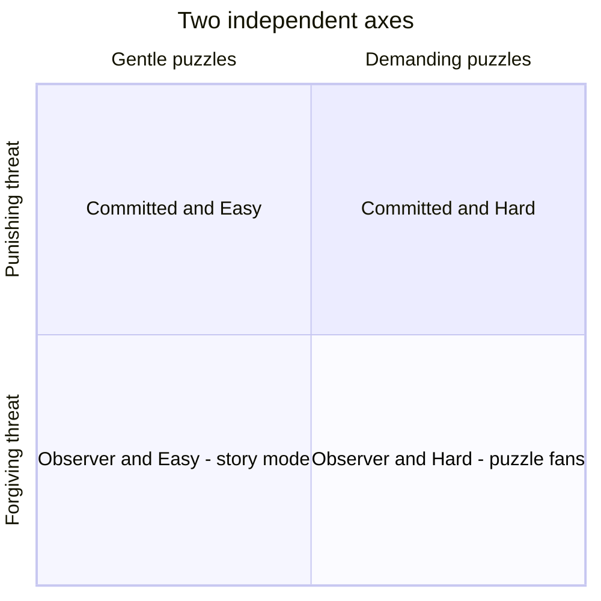
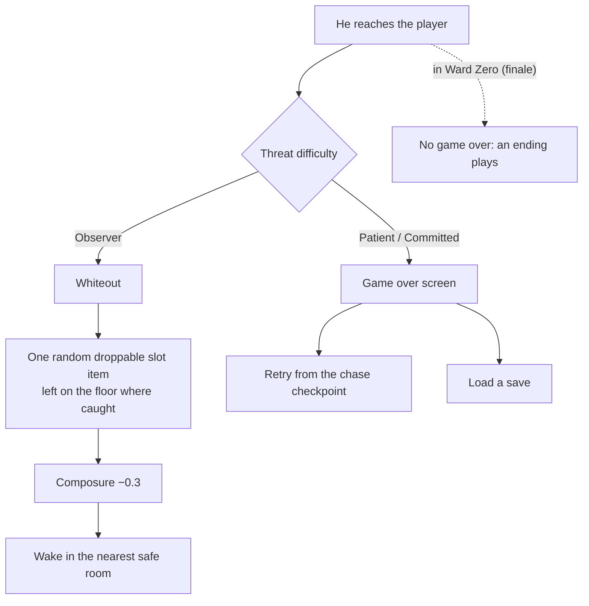
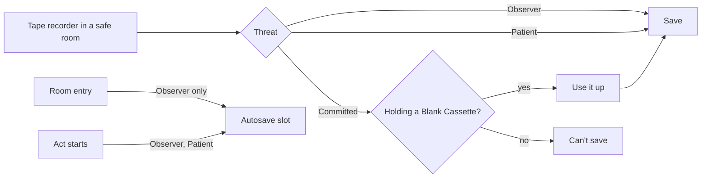
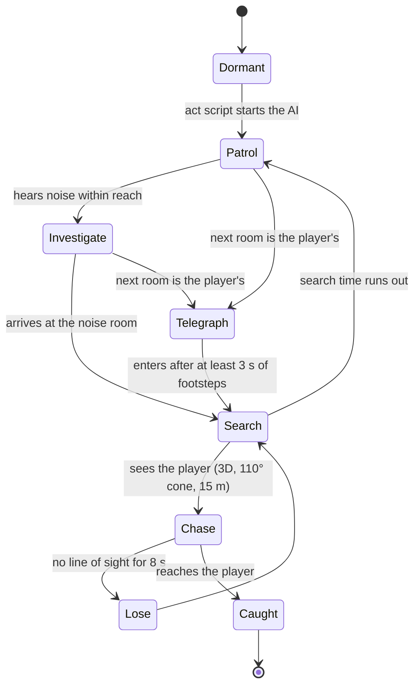
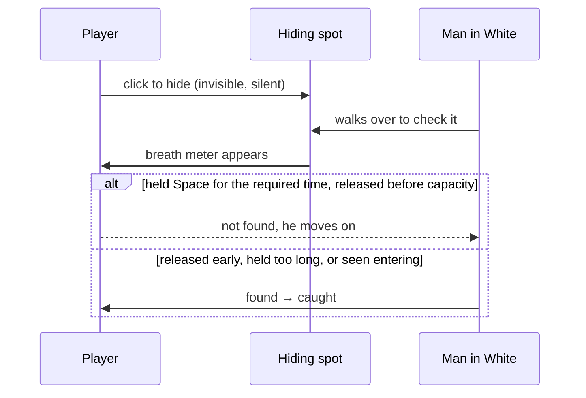
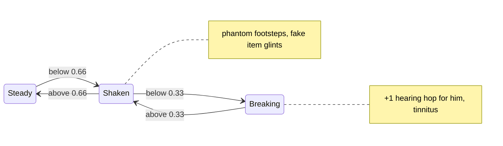
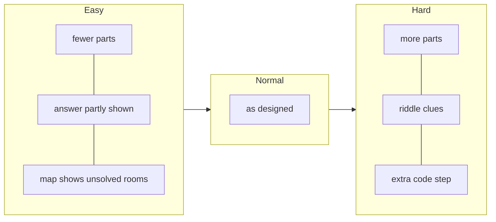

# Difficulty

Ward Zero has two independent difficulty axes, chosen at New Game (GDD §8): **Threat** (the stalker and saving) and **Puzzles** (clue directness and puzzle size). All 9 combinations can be played to every ending, and the full-game test proves it on each one.

| Setting | Lives in | Read by |
|---|---|---|
| Threat (`observer`, `patient`, `committed`) | `game/data/tuning/<threat>.tres` (`StalkerTuning`) | `Difficulty.tuning()`, StalkerDirector, RoomManager, SaveScreen |
| Puzzles (`easy`, `normal`, `hard`) | `PuzzleData.params` per puzzle; `DocumentData.body_key_by_difficulty` per clue | `PuzzleValues.make_logic()`, `DocumentRenderer` |

Both are stored in `GameState` and saved with the game. New Game+ uses the same choice screen.

---

## 1. Threat difficulty

| | **Observer** | **Patient** | **Committed** |
|---|---|---|---|
| Caught | Not lethal: whiteout, wake in the nearest safe room, one droppable item left where you were caught, composure −0.3 | Game over → retry checkpoint or load | Game over → retry checkpoint or load |
| Saving | Autosave on every room entry + unlimited saves at tape recorders | Unlimited saves at recorders; autosave at New Game and at the start of each act | Each save uses up a **Blank Cassette** |
| Stalker walk / run (m/s) | 1.2 / 2.2 | 1.5 / 2.8 | 1.7 / 3.1 |
| Hearing (extra hops) | −1 | 0 | +1 |
| Search time per room (s) | 6 | 10 | 14 |
| Breath hold: required / capacity (s) | 1.5 / 6.0 | 2.5 / 4.5 | 3.5 / 4.2 |
| Close-ups pause the world | Yes | No | No |

The player walks at 1.6 m/s and runs at 3.6 m/s, so running always outpaces him. Safe rooms (★), which he never enters: G01, W06, U03, B05.

### What happens when he catches you

### Saving

10 manual slots plus an autosave slot. Any save can be exported as a text code (`WZ1-…`) and imported on another device.

---

## 2. The stalker

He moves on a graph of rooms off-screen, and only becomes a 3D character when he enters the player's room. Each act gives him a patrol route.

**Hearing.** A noise of *h* hops reaches him if his room is within *h* + difficulty bonus + 1 (if composure is Breaking) + the act's bonus, counted in rooms. Running and failed puzzles make noise. A failed boiler is 2 hops.

**Telegraph (rule R9).** Before he enters, footsteps play for at least 3 seconds, panned toward the door he's coming through. He never appears without warning.

**Where he can go.** He walks only through rooms marked `open`. He never enters safe rooms or a room the player has shifted into 1976. He enters puzzle rooms (`scripted`) only through a script. Locked doors don't stop him.

### Per-act behaviour

| Act | Route | Starts in | Modifiers |
|---|---|---|---|
| 1 | None: one scripted chase in the Lobby (1.6× walk speed) | G02 | — |
| 2 | G07 → G09 → E01 → E05 → E04 → E01 → G09 → W01 → W05 → W01 → G09 | E05 | — |
| 3 | U01 ↔ G09 | G09 | Speed ×1.2 |
| 4 | B02 ↔ B07 | B07 | Speed ×1.15, +1 hearing hop, searches ×1.5 |
| Finale | Spawns behind the player in Ward Zero, walks at 0.8× the player's walk | B07 | No game over |

The active act and its modifiers are saved with the AI's state.

### Hiding

The breath meter is the visual twin of the breathing sound (rule R6). Observer is generous (1.5 s of a 6 s capacity); Committed is tight (3.5 s of 4.2 s).

---

## 3. Composure (hidden meter)

| Cause | Change |
|---|---|
| He's in sight | −0.08 per second |
| Unlit room | −0.01 per second |
| Caught on Observer | −0.3 |
| Safe room | +0.02 per second |
| Sedatives | +0.4 |
| Memory shift completed | +0.15 |

Fake glints never sit on puzzle-critical items (rule R2). Composure affects all threat levels the same way.

---

## 4. Puzzle difficulty

| Level | Philosophy (GDD §8.2) |
|---|---|
| **Easy** | Direct clues, codes partly shown, fewer parts. The map marks rooms with an unsolved puzzle (◆). |
| **Normal** | As designed. |
| **Hard** | Clues as riddles, an extra step on codes, more parts. |

### Every puzzle, every level

| Puzzle | Easy | Normal | Hard |
|---|---|---|---|
| P01 Radio | Station marked on the dial | Frequency on the notice | The notice gives a sum to work out |
| P02 Switchboard | 2 cables | 3 cables | 4 cables, via Records |
| P03 Card catalog | Labels not swapped | Two labels swapped | Two labels swapped |
| P04 Wall safe | First two digits shown | Year + shift | Year + shift, read backwards |
| P05 Hymn board | 2 rows | 3 rows | Titles only; the hymnal maps them to numbers |
| P06 Medication cart | 3 patients, the chart gives both clues | 4 patients | 5 patients |
| P07 Hydrotherapy | 2 tubs + tap | Standard | 3 big tubs (12/7/5) |
| P08 Linen room | The note gives the tag | Ledger lookup | Ledger lookup |
| P09 Drawings | Dates on the front | Dates on the back | Dates on the back |
| P10 Chalkboard | 3 digits in the present | 2 now + 2 in 1976 | 2 now + 2 in 1976 |
| P11 Music box | 4 notes | 6 notes | 8 notes |
| P12 Knocks | 3 knocks | 4 knocks | 6 knocks |
| P13 Boiler | Each valve moves one gauge | Each valve moves two | Each valve moves two |
| P14 Library | 3 books | 5 books | 7 books |
| P15 Pharmacy scale | Dial shows the total | One pan | Weights 1/3/9/27 on both pans |
| P16 Projector | Slides numbered | Topics in order | Only "X before Y" pairs |
| P17 Director's safe | Code from P16 | Code from P16 | Code from P16 |
| P18 Clock | Note points at the clipping | "The hour it happened" | A riddle |
| P19 Morgue | Plain registry | Plain registry | Terse registry |
| P20 Humors panel | Elements on the keyholes | Mural lists everything | Mural as images only |
| P21 Archive vault | Same on all levels: the score decides the ending | ← | ← |

---

## 5. Recommended pairings

| Player | Threat | Puzzles |
|---|---|---|
| Here for the story | Observer | Easy |
| First time, wants the intended experience | Patient | Normal |
| Survival-horror veteran | Committed | Normal |
| Puzzle lover who hates being chased | Observer | Hard |
| Everything at once | Committed | Hard |

## 6. Blank Cassettes (Committed)

They only appear on Committed, and every floor has some. Rooms: G03, G06, G07, E05, W04, W06, B01 (Acts 1–2); U01, U03, U05 (Act 3); B02, B05 (Act 4). That makes 12 in all. A test checks there are at least 12 and that each floor has one.
