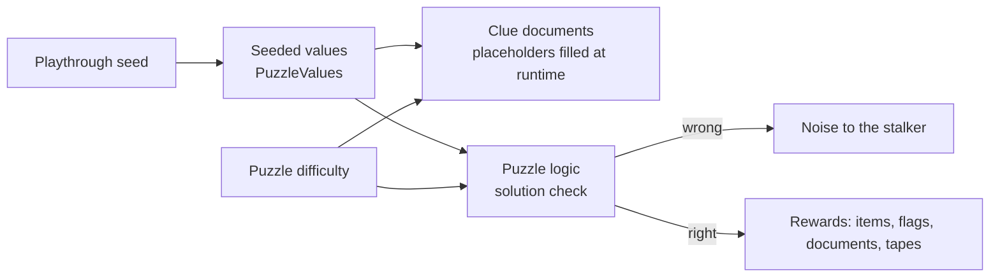
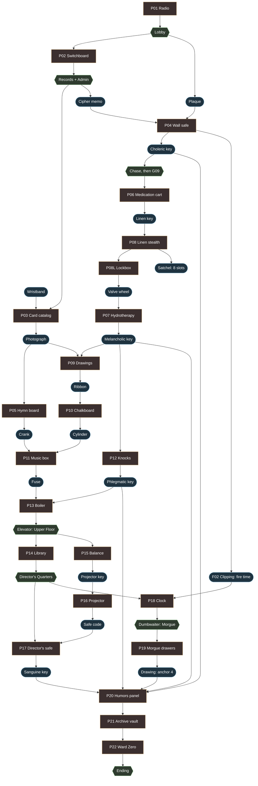
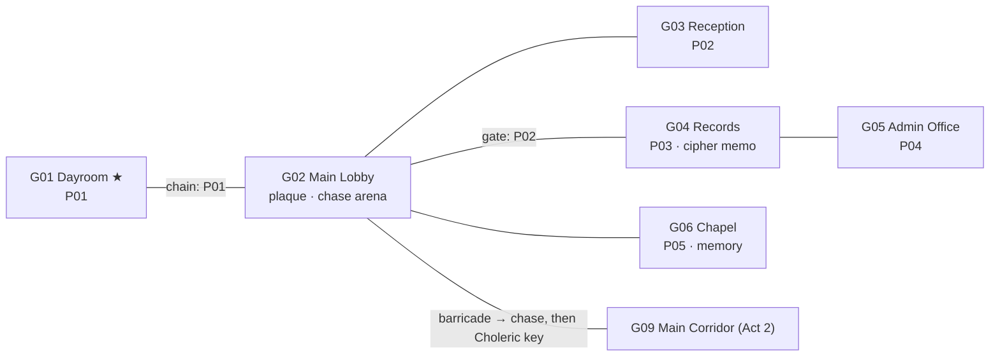
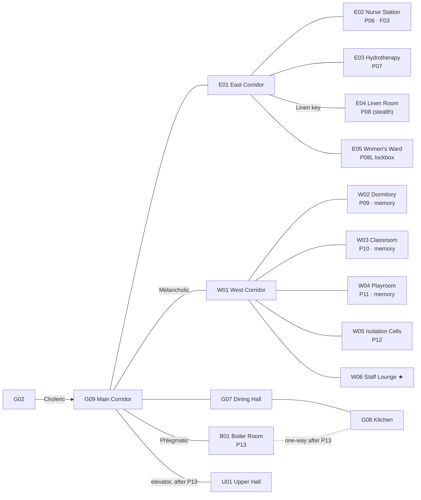
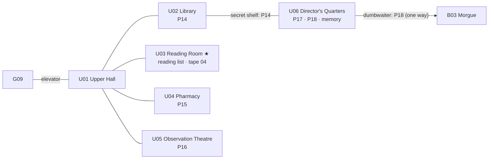
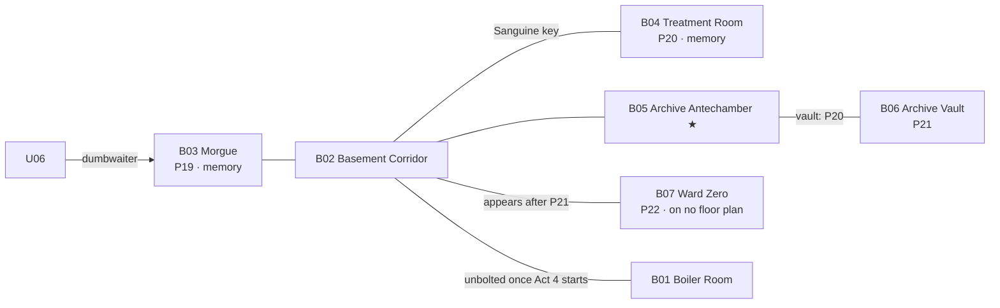
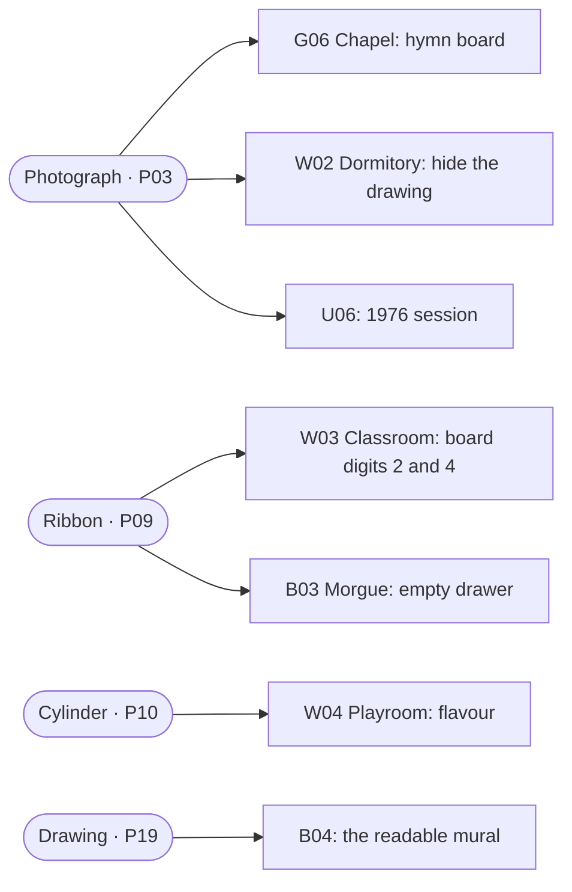

# Puzzles

Every puzzle in the game as built: what it asks, where its clues are, what changes with difficulty, and what it unlocks. Data lives in `game/data/puzzles/*.tres` (generated by `tools/content/build_act1_data.gd`). Logic lives in `game/puzzles/<id>/<id>_logic.gd`. For the difficulty system itself, see [`difficulty.md`](difficulty.md).

## 1. Rules every puzzle follows

| Rule | Meaning |
|---|---|
| **Seeded** | Numbers, orders and codes come from the playthrough seed (`Seed`, ADR-005). A walkthrough can't hand out answers, and New Game+ gets new ones. |
| **Clue first** (R8) | Every clue is reachable before the puzzle that needs it, and kept in Files or re-examinable. Tests check every clue against its solution over many seeds on all difficulties. |
| **No dead ends** (R7) | Any input can be undone. A test plays 60 random inputs, then proves the puzzle can still be solved. |
| **Failure costs noise, not progress** | A wrong attempt makes noise (0–2 hops) that the stalker can hear. Progress is never lost. |
| **Never colour alone** (R5) | Colour always comes with a shape, symbol or word. |
| **Audio has a visual twin** (R6) | P11 has the lid sheet; P12 has falling dust. |

## 2. The whole game as a dependency graph

Boxes are puzzles, rounded boxes are items and keys, hexagons are places that open.

F02 is picked up in Act 1 but used in Act 3 (P18), and all four temperament keys stay in the pouch for P20.

---

## 3. Act 1: Arrival

| | **P01 Radio** | **P02 Switchboard** | **P03 Card catalog** | **P04 Wall safe** | **P05 Hymn board** |
|---|---|---|---|---|---|
| Room | G01 | G03 | G04 | G05 | G06 |
| Mechanic | Tune the dial to the station | Patch cables along a chain of roles, then ring | Find your card by birthdate. Two drawer labels are swapped. The card gives the cabinet. | 4 wheels. Code = each digit of the founding year + shift, mod 10. | Set the present board to the numbers on the 1976 board |
| Clues | Quiet Hours notice | Staff directory (role → extension), desk memo (route) | Wristband (examine the inside) | Founding plaque (G02), cipher memo (G04) | 1976 hymn board (memory shift with the Photograph) |
| Seeded | Frequency 550–1600 kHz, step 10 | Unique 3-digit extensions per role | Birth day/month, cabinet, swap offset | Founding year 1890–1925, shift 1–9 | 3 hymn numbers 100–699, 3 titles |
| Easy | Station marked on the dial | 2 cables | Labels not swapped | First 2 digits shown on the safe | 2 rows |
| Normal | Frequency on the notice | 3 cables | Labels swapped | As written | 3 rows |
| Hard | Notice gives a sum to work out | 4 cables (via Records) | Labels swapped | Then read the digits backwards | Board shows titles; the hymnal index maps them to numbers |
| Noise | 0 (tutorial) | 1 | 1 | 1 | 1 |
| Reward | Chain drops | Lobby gate opens | **F01**, **Photograph** (anchor 1) | **Choleric key**, **F02** | Choir loft → **crank** |

**Reveal chase.** The first time the player enters the Lobby holding the Choleric key, the barricade breaks and the Man in White walks out. The player runs back to the Dayroom.

---

## 4. Act 2: The Wards

| | **P06 Medication cart** | **P07 Hydrotherapy** | **P08 Linen room** | **P08L Lockbox** |
|---|---|---|---|---|
| Room | E02 | E03 | E04 | E05 |
| Mechanic | Put each patient's pill in their drawer | Water jugs: pour, drain, main valve resets | Pull the stained sheet; the stalker is active | 3-wheel code |
| Clues | Charts give each pill's **shape**, the shift log its **colour** (always in words) | Gauge markings | Ledger maps bed + day → tag; a note gives bed and day | The sheet's label (from P08) |
| Seeded | Patient → colour/shape pairs | One config from a verified list | 12 tags, target, bed, day, lockbox code | Shared with P08 |
| Easy | 3 patients; the chart gives both | 2 tubs + tap (5/3 → 4) | The note gives the tag directly | — |
| Normal | 4 patients | Standard config | As written | — |
| Hard | 5 patients | 12/7/5 → 6/6/0 | As written | — |
| Noise | 1 | 0 | 1 per wrong pull | 1 |
| Needs | — | Valve wheel | Linen key | — |
| Reward | **Linen key**, **Sedatives** | **Melancholic key** | Lockbox code, **Satchel** (8 slots) | **Valve wheel** |

| | **P09 Drawings** | **P10 Chalkboard** | **P11 Music box** | **P12 Knocks** | **P13 Boiler** |
|---|---|---|---|---|---|
| Room | W02 | W03 | W04 | W05 | B01 |
| Mechanic | Hang 6 drawings in story order (dates on the backs) | 4-digit padlock | Set the cylinder pins to the lullaby | Open the peepholes in knock order | Fit the fuse; set 3 valves so all 3 gauges sit in the green |
| Clues | One drawing exists only in 1976: hide it behind the radiator there, take it in the present (persistent object) | Present board shows digits 1 and 3; the 1976 board (Ribbon shift) shows 2 and 4 | Lid sheet names the notes (visual twin of the tape) | Knocks, with dust falling from the knocking door (visual twin) | Maintenance manual |
| Seeded | 6 dates | 4-digit code | Melody, 5 notes | Knock sequence over 5 doors | Valve solution |
| Easy | Dates on the front | 3 digits in the present | 4 notes | 3 knocks | Each valve moves one gauge |
| Normal | Dates on the back | 2 + 2 across both boards | 6 notes | 4 knocks | Each valve moves two gauges |
| Hard | Dates on the back | 2 + 2 across both boards | 8 notes | 6 knocks | Each valve moves two gauges |
| Noise | 1 | 1 | 1 | 1 per wrong door | **2** (a gauge in the red is loud) |
| Needs | Photograph shift | Ribbon shift | Crank + cylinder | — | Fuse |
| Reward | **F04**, **Ribbon** (anchor 2) | **F05**, **Cylinder** (anchor 3) | **Fuse** | **Phlegmatic key**, **F06** | Elevator power, kitchen shortcut, **F07** tape |

---

## 5. Act 3: Upper Floor

| | **P14 Library** | **P15 Pharmacy scale** | **P16 Projector** | **P17 Director's safe** | **P18 Grandfather clock** |
|---|---|---|---|---|---|
| Room | U02 | U04 | U05 | U06 | U06 |
| Mechanic | Shelve the cart's books in call-number order | Put weights on the pans until the scale balances at the dose | Load 6 slides in lecture order; slides 2 and 5 overlap on the screen | 4-digit lock | Set the hands and pull the chain |
| Clues | Reading list in U03 (title → number) | Prescription (dose in grams) | Lecture notes (topics in order) | The code on the screen after P16 | F02 clipping (fire time, from Act 1) + a note on the desk |
| Seeded | 7 unique call numbers 100–999 | Target 5–31 g | Slide order, safe code | Shared with P16 | Fire hour 1–4, minute in steps of 5 |
| Easy | 3 books | Weights 1/2/4/8/16; the dial shows the total | Slides numbered as in the notes | — | Note says "the time in the clipping" |
| Normal | 5 books | Weights 1/2/4/8/16, one pan | Topics listed in order | — | Note: "the hour it happened" |
| Hard | 7 books | Weights 1/3/9/27 on **both** pans | Notes give only "X comes just before Y" pairs, shuffled | — | Riddle: "time stopped when the farmhouse burned" |
| Noise | 1 | 1 | 0 | 1 | 1 |
| Needs | — | — | Projector key | Reach U06 (P14) | Reach U06 (P14) |
| Reward | Secret door to U06 | **Projector key**, **F09** | Safe code on the screen, **F10** | **Sanguine key**, **F08** | Dumbwaiter to the Morgue |

**U06 memory:** the Photograph at the armchair shows a 1976 session: the Director with young Mathieu, who asks *"Where does Claire sleep?"*

---

## 6. Act 4: Below

| | **P19 Morgue** | **P20 Humors panel** | **P21 Archive vault** | **P22 Ward Zero** |
|---|---|---|---|---|
| Room | B03 | B04 | B06 | B07 |
| Mechanic | Open the drawer of "the girl from the fire" | Put each temperament key in the keyhole of its season | Place each fragment you hold on the 1975→1998 timeline, then close the file | He walks out of the dark behind you. Take the exit, or stand still. |
| Clues | Death registry (5 entries with drawer numbers) | The mural, readable only in 1976 (Drawing shift); in the present it's water-damaged | Fragment dates in the documents themselves | — |
| Seeded | 5 unique drawers out of 12 | Season order of the 4 keyholes | Fixed by the story | — |
| Easy | — | Keyholes also show the element | — | — |
| Normal | Registry: "Female, 6. Burns – farmhouse fire" | Mural lists temperament → element → season | — | — |
| Hard | Registry is terse: "F, 6. Smoke." | Mural as images only (a red-faced man in a wheat field…) | — | — |
| Noise | 1 per wrong drawer | 1 | 0 | — |
| Needs | — | All 4 temperament keys | — | P21 sealed |
| Reward | **Drawing** (anchor 4), **F11** | Vault opens, **F12** tape | Score saved; Ward Zero's door appears | Ending (see [`story.md`](story.md) §8) |

P21 always "succeeds". Its score (0–12 fragments in the right slot) decides the ending. The close-up asks for confirmation, because a closed file can't be changed.

---

## 7. Memory anchors

Using an anchor at a room's resonant spot shifts that room to 1976. The stalker can't follow into a memory. Leaving by any door, or using the spot again, returns to the present (+0.15 composure).
