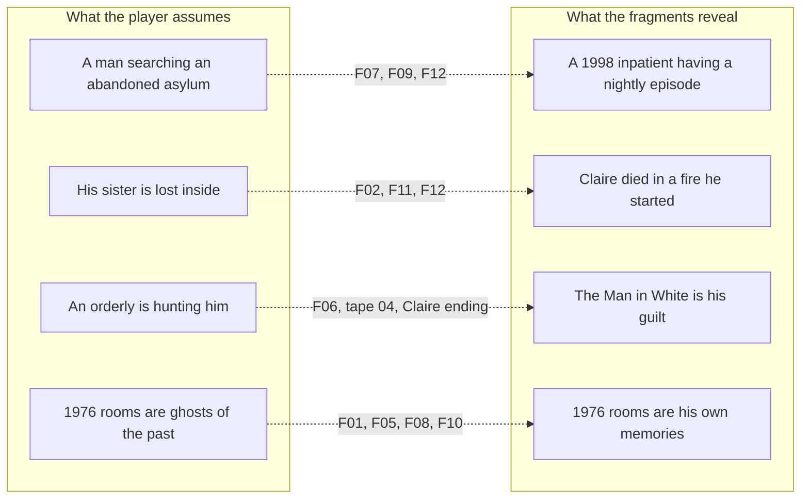
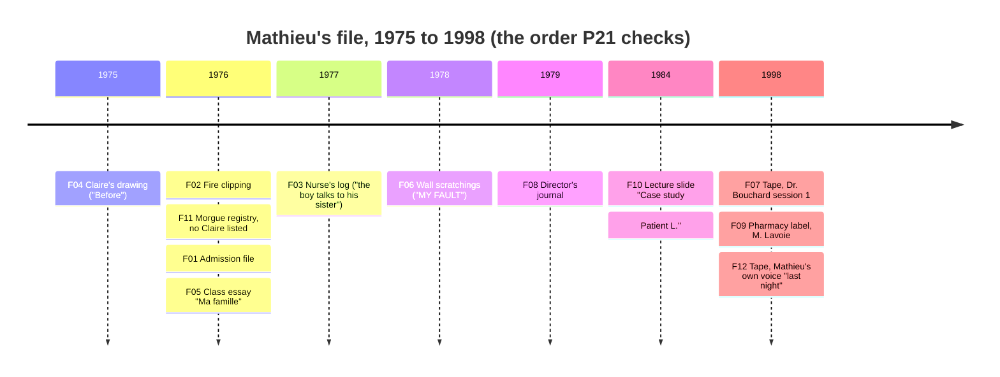
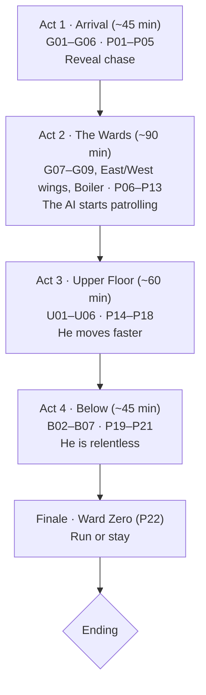
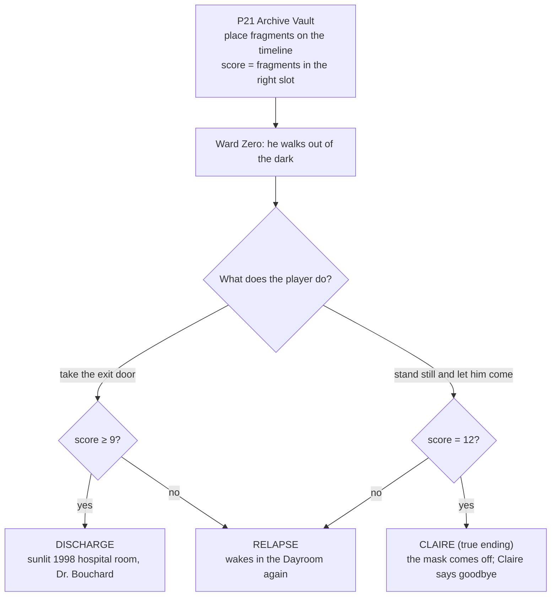
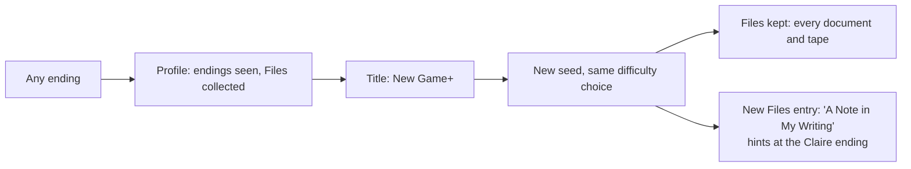

# Story

How the story is built and delivered in the game as it stands. The source of truth for intent is [`GDD.md`](../GDD.md) §2. This page describes what is actually implemented, and marks proposed details.

## 1. Premise in one paragraph

Mathieu Lavoie, 31, wakes inside the derelict Institut Sainte-Odile, an asylum in rural Québec that closed in 1981. A dictaphone plays a child's voice: *"Mathieu… viens me chercher."* He believes he has come to find his little sister Claire. He hasn't. In 1976, at nine, he started the house fire that killed Claire, who was six. He was committed to Sainte-Odile and pushed the event out of memory. In 1998, the game's "present", he is an inpatient of the modern unit built on the old grounds. Every night he relives Sainte-Odile in a dissociative episode and tries to escape it. The Man in White who hunts him is his guilt.

## 2. Two layers: what the player sees vs. what is true

The game never states the truth outright before the finale. Each fragment moves one assumption, and the player puts the pieces together in P21.

## 3. Characters

| Character | Role | Where they appear |
|---|---|---|
| **Mathieu Lavoie** | The player. 9 in 1976, 31 in 1998. | Everywhere. His adult voice is on tape 05 (F12). |
| **Claire Lavoie** | His sister, 6, died in the 1976 fire | Tape 01, the Photograph, the Ribbon, drawings, the Claire ending |
| **The Man in White** | Stalker. Looks like an orderly. Is Mathieu's guilt. Never speaks. | Act 1 chase, then the AI in Acts 2–4. Unmasked only in the Claire ending. |
| **Dr. Hélène Bouchard** | Mathieu's 1998 psychiatrist, the only kind voice | Tape 02 (F07), the Discharge ending |
| **The Director** | Ran Sainte-Odile in the 1970s. Decided to stop telling the boy the truth. | Tape 04, F08 journal, the U06 1976 memory scene, the portrait in U01 |

## 4. Timeline (the order P21 asks the player to rebuild)

The exact years are **proposed** (`P21Logic.TIMELINE` / `YEARS`). The GDD says the timeline starts in 1976. F04 is dated 1975 so the drawing ("Before") comes first.

## 5. Truth fragments

| ID | Fragment | Act | Found | Req/Opt | What it moves |
|---|---|---|---|---|---|
| F01 | Admission file, 1976 | 1 | G04 Records, P03 | Req | He was a patient here as a child |
| F02 | Clipping: house fire, girl dies | 1 | G05 Admin Office, P04 | Req | Claire died; the fire time is planted for P18 |
| F03 | Nurse's log: "the boy talks to his sister" | 2 | E02 Nurse Station (pickup) | Opt | He talked to a sister who wasn't there |
| F04 | Claire's crayon drawing | 2 | W02 Dormitory, P09 | Req | Two children "Before" |
| F05 | Class essay "Ma famille" by M.L. | 2 | W03 Classroom, P10 | Req on the path | His family story, in his own words |
| F06 | Wall scratchings: tallies and "MY FAULT" | 2 | W05 Isolation Cells, P12 | Req on the path | Guilt, written by the child |
| F07 | Tape: Dr. Bouchard, session 1, 1998 | 2 | B01 Boiler Room, P13 | Req | It is 1998, and he is in therapy |
| F08 | Director's journal | 3 | U06 Director's Quarters, P17 | Req | The staff chose to let him forget |
| F09 | Pharmacy label, M. Lavoie, 1998 | 3 | U04 Pharmacy, P15 | Opt (on the path) | He is on medication now |
| F10 | Lecture slide "Case study: Patient L." | 3 | U05 Theatre, P16 | Req | His case was taught; readmitted in 1998 |
| F11 | Morgue registry page: no Claire | 4 | B03 Morgue, P19 | Opt (on the path) | She was never brought here |
| F12 | Tape: his own voice, "last night" | 4 | B04 Treatment Room, P20 | Req | *"I had the matches."* |

On the current critical path every puzzle is required, so the player reaches the vault with 11 fragments. F03 is the only pure exploration pickup. **12/12 needs F03.**

## 6. Narrative delivery

| Channel | Content | Notes |
|---|---|---|
| **Tapes** (6, subtitled, EN/FR) | 01 Claire ("viens me chercher"), P01 radio message, 02 Bouchard (F07), 03 Lullaby, 04 Director, 05 Last Night (F12) | Kept in Files except the radio VO |
| **Documents** (41) | Notices, memos, charts, ledgers, letters, fragments | Seeded puzzle values are filled into the templates |
| **Memory shifts** | 1976 versions of 7 rooms (G06, W02, W03, W04, U06, B03, B04) | The past is warm and lived-in; the present is decayed |
| **Room text** | Examine lines, resonant spots, locked-door lines | e.g. U06's 1976 scene: *"Where does Claire sleep?"* |
| **The stalker** | Behaviour only: silent, relentless, never explained | The unmasking is the only explanation |

## 7. Act structure

| Act | Story beat | Turning point |
|---|---|---|
| 1 | He thinks he is searching for Claire. The building answers with his own admission file. | The Man in White breaks out of the corridor (chase). |
| 2 | The wards where he lived as a child. Claire appears only in drawings and lullabies. | Session 1 tape: it is 1998 and he is a patient. |
| 3 | The staff's view of him: Director, pharmacy, lecture theatre. | Director's journal: they chose to let him forget. |
| 4 | The basement: the morgue that never held her, the treatment room. | His own voice: *"I had the matches."* |
| Finale | Ward Zero, a room on no floor plan. | He stops running, or doesn't. |

## 8. Endings

- The rules live in `Ending.compute(score, stayed)`. Being caught without 12/12 plays Relapse, not a game over (**proposed**).
- Every ending is recorded in `user://profile.cfg` and unlocks **New Game+**.

## 9. New Game+

Codes change with the new seed, so old notes give old answers. The kept documents re-render with the new values.
